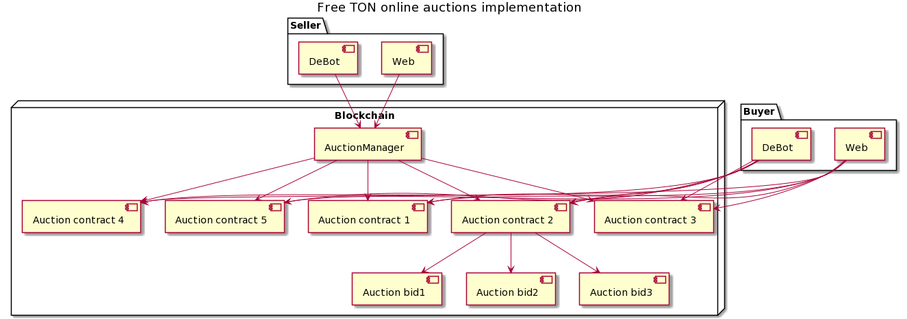

# Online auctions implementation

`Author`: Anton Platonov

`Telegram`: @SuperArmor

`Wallet Address`: 0:cba39007bdb0f025aac0609b25e96a7d2153f06d22fa47b5f6c26cf756b8b2d6

`[devnet] Auction Manager address`: 0:e70f6f581dd7b973dc71ce77493c2e11b7bfa29798497a28bfe7f54d5c5bbd34

`[devnet] DeBot address`: 0:a9b2bfbe46ee7ee40f9cee04faa59989b9d45c1c32d29f10cc9eb0ceb59b124a

# Diagram

# Summary

Auction escrow implementation with guaranteed asset delivery.

Asset example in this implementation is DnsRecord contract (https://github.com/laugual/dens-v2);

# Features

Auction types:
* `English Forward auction`: Fully implemented; details below;
* `English Reverse auction`: Logic is almost identical to `Dutch Forward auction`, but not implemented because there's no way to guarantee the asset delivery; details below;
* `English Blind auction`: Fully implemented; details below;
* `Dutch Forward auction`: Fully implemented; details below;
* `Dutch Reverse auction`: Logic is almost identical to `English Forward auction`, but not implemented because there's no way to guarantee the asset delivery; details below;
* `Dutch Blind auction`: actually impossible to implement a blind auction for a decreasing bet. Will 1 nanoton bet always win?
* `Public buy auction`: Fully implemented; details below;
* `Private buy auction`: Fully implemented; details below;

# Auctions

## English Forward

An auction, which can be used by sellers to sell their items to many potential buyers. Bidding price for an item starts from a minimum value with optional "buy now" price and goes up as the buyers place their bids. Auction ends when "buy now" price is reached or when auction period ends.

Contract: `/contracts/AuctionDnsRecord.sol`

Asset delivery is guaranteed.

## English Reverse

In reverse auction there is one buyer and many potential sellers. Sellers compete to obtain business from the buyer and prices will typically decrease as the sellers underbid each other. Logic is similar to `Dutch Forward` auction.

**Asset delivery is not guaranteed**, because the buyer creates an auction (and he doesn't have asset) and the sellers (with a potential asset) are competing with each other.

Technically it is easy to create `English Reverse` auction, but respecting blockchain anonimous nature only auctions with guaranteed asset delivery were implemented in this submission to exclude fraud.

## English Blind

An auction, which can be used by sellers to sell their items to many potential buyers. Bidding price for an item starts from a minimum value with no `buy now` price, bidders don't place actual bids but hashes of bids (calculated from price + salt). Bids are accepted while auction lasts, then comes the `Reveal Phase` when bidders need to reveal their price + salt sending these values with the same amount of TON Crystals attached. When the reveal phase is over top bidder receives an asset.

Contract: `/contracts/AuctionDnsRecord.sol`

Asset delivery is guaranteed.

## Dutch Forward

An auction, which can be used by sellers to sell their items to many potential buyers. It contains a list of items that buyers want to procure and the price rises after fixed intervals until a reserved price is reached. Before the reserved price is reached, if a supplier places a bid for the item, it is allocated to the supplier and the item closes for bidding. Logic is similar to `English Forward` auction.

Contract: `/contracts/AuctionDnsRecord.sol`

Asset delivery is guaranteed.

## Dutch Reverse

In reverse auction there is one buyer and many potential sellers. Sellers compete to obtain business from the buyer and prices will typically decrease as the sellers underbid each other. Logic is similar to `English Forward` auction with `Dutch Forward` price periods.

**Asset delivery is not guaranteed**, because the buyer creates an auction (and he doesn't have asset) and the sellers (with a potential asset) are competing with each other.

Technically it is easy to create `Dutch Reverse` auction, but respecting blockchain anonimous nature only auctions with guaranteed asset delivery were implemented in this submission to exclude fraud.

## Dutch Blind

`Dutch Blind` auction is technically impossible. Will the 1 nanoton bid always win? :)

## Public buy

Escrow deal without `auction` part, but with `buy now` price. `Public` means anyone can buy an asset using `buy now` price. First buyer is automatically a winner.

Contract: `/contracts/AuctionDnsRecord.sol`

Asset delivery is guaranteed.

## Private buy

Escrow deal without `auction` part, but with `buy now` price. `Private` means buyer is pre-determined and only he can buy an asset. The safest peer-to-peer deal possible.

Contract: `/contracts/AuctionDnsRecord.sol`

Asset delivery is guaranteed.

